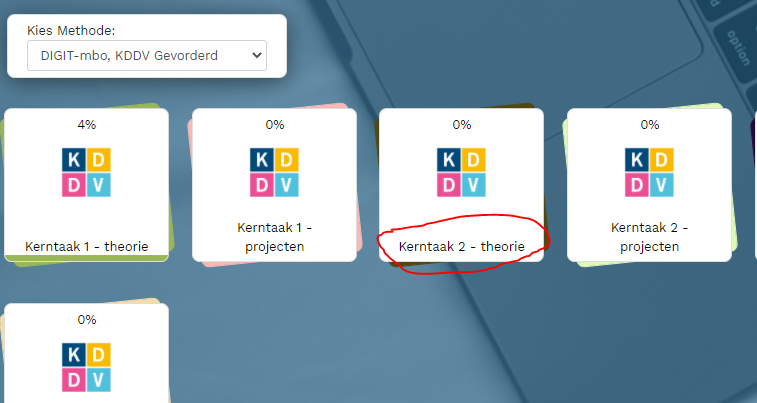
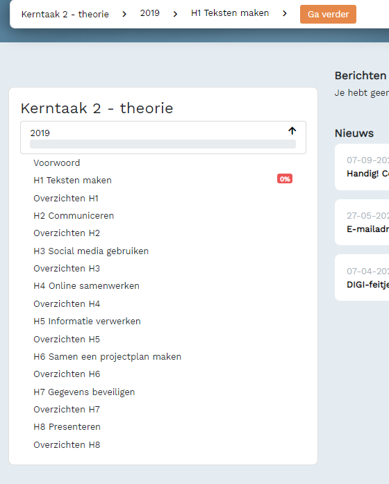

# kd-digitale-vaardigheden-2 - OEFENEN - Taak03 - oefenen KT2

## Uitleg
Je hebt in de vorige taak genoteerd voor welke hoofdstukken je een onvoldoende had.
Heb je dit niet gedaan doe dan taak 2 nog een keer.

## Opdrachten
1. Log in op: [Digit-MBO](https://entree.instruct.nl/?elo=digit-mbo).
1. Ga naar de [home pagina](https://digit-mbo.nl/student/home/).
2. Klik op de tegel Kerntaak 2.

3. Maak de hoofdstukken waar je een onvoldoende voor had (klik op het hoofdstuk).

## Leerdoelden
1. Je maakt de opdrachten van de hoofdstukken waar je een onvoldoende voor had.

## Eindresultaat
Het beheersen van de hoofdstukken in Kerntaak 2.

### Bronnen
[Digit-MBO](https://entree.instruct.nl/?elo=digit-mbo).